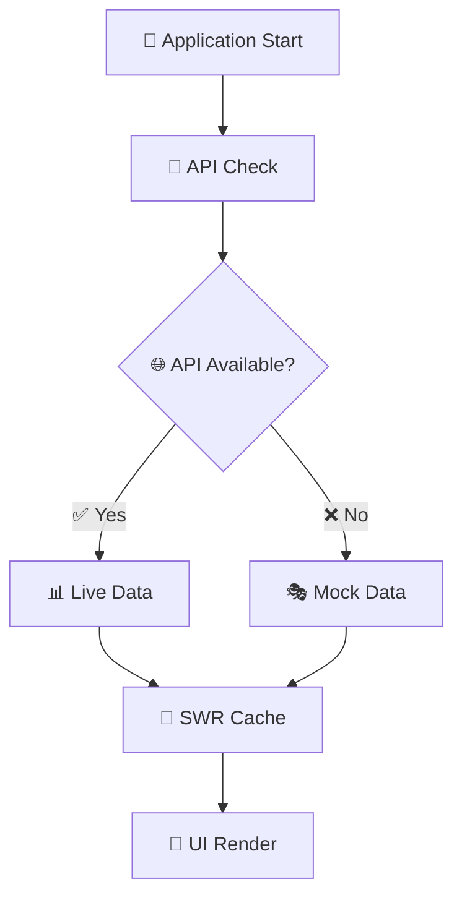

<div style="text-align: center;">

# 🚢 Freight Billing Portal

### *Modern React-based billing management system for freight operations*

[](https://reactjs.org/)
[](https://developer.mozilla.org/en-US/docs/Web/JavaScript)
[](https://tailwindcss.com/)
[](https://github.com)

*Comprehensive order tracking • Invoice management • Client relationships • Financial reporting*

---

</div>

## ✨ Features

<table>
<tr>
<td style="width: 50%;">

### 📊 **Dashboard Analytics**
- 🎯 Real-time billing metrics & KPIs
- 📈 Interactive revenue pipeline visualization
- 🚫 Billing blockers tracking with month selection
- 📡 Live activity feed & notifications

### 🧾 **Invoice Management**
- 💰 Complete invoice generation & tracking
- 🔍 Status monitoring (Paid/Outstanding/Overdue/Draft)
- ⬇️ One-click download functionality
- ⚠️ Automated overdue highlighting system

</td>
<td style="width: 50%;">

### 📦 **Order Operations**
- 🚚 Full order lifecycle management
- 🏷️ Smart status filtering & categorization
- 🔎 Advanced searchable order database
- ⚡ Real-time order tracking & updates

### 👥 **Client Relations**
- 👤 Comprehensive client profile management
- 🔄 Flexible grid/list view switching
- 📊 Performance metrics & analytics
- 🌍 Industry & location tracking

</td>
</tr>
</table>

### 📈 **Advanced Reporting**
> Interactive revenue trends • Order distribution analytics • Top-performing clients • Export functionality

---

## 🛠️ Tech Stack

<div style="text-align: center;">

| Frontend | State Management | Styling | Animation |
|----------|------------------|---------|-----------|
|  |  |  |  |
|  |  |  |  |

</div>

---

## 🚀 Quick Start

<details>
<summary><b>📋 Prerequisites</b></summary>

```bash
Node.js >= 16.x
npm >= 8.x
Modern browser (Chrome, Firefox, Safari, Edge)
```

</details>

### 🏃‍♂️ **Installation**

```bash
# 📥 Clone the repository
git clone [your-repo-url]
cd billing-portal

# 📦 Install dependencies
npm install

# 🚀 Start development server
npm start
```

<div style="text-align: center;">
<b>🌐 Application available at:</b> <code>http://localhost:3000</code>
</div>

### ⚙️ **Environment Configuration**

Create a `.env` file in the root directory:

```env
# 🔗 API Configuration
REACT_APP_API_URL=http://localhost:3000/api

# 🏗️ Build Configuration
GENERATE_SOURCEMAP=false
```

---

## 🎨 Architecture

<div style="text-align: center;">

### 🏗️ **Feature-Based Architecture**

</div>

```
📁 src/
┣ 🎯 features/              # Business domain features
┃ ┣ 📊 dashboard/           # Real-time metrics & analytics
┃ ┣ 📦 orders/              # Order management system
┃ ┣ 🧾 invoices/            # Invoice generation & tracking
┃ ┣ 👥 clients/             # Client relationship management
┃ ┗ 📈 reports/             # Financial reporting & analytics
┣ 🧩 components/            # Reusable UI components
┃ ┣ 🎨 ui/                  # Core components (StatCard, StatusBadge)
┃ ┣ 🏠 layout/              # Layout components (Header, Navigation)
┃ ┗ 🔍 filters/             # Search & filter components
┣ 🔌 api/                   # API client & SWR configuration
┣ 🗄️ store/                 # Zustand global state management
┣ 🎨 theme/                 # Design tokens & styling system
┗ 🛠️ utils/                 # Utility functions & helpers
```

### 🧠 **State Management Strategy**

<table>
<tr>
<td style="width: 50%; text-align: center;">

**🌐 Server State**
<br>
*SWR for data fetching & caching*
<br>
📡 Real-time synchronization
<br>  
🔄 Automatic revalidation
<br>
💾 Intelligent caching

</td>
<td style="width: 50%; text-align: center;">

**💻 Client State**
<br>
*Zustand for UI state management*
<br>
🎨 Theme preferences
<br>
🔍 Filters & search
<br>
📱 UI interactions

</td>
</tr>
</table>

---

## 🎯 Development

### 📝 **Available Scripts**

| Command | Description | Usage |
|---------|-------------|-------|
| `npm start` | 🚀 Development server | Primary development |
| `npm run build` | 🏗️ Production build | Deployment preparation |
| `npm test` | 🧪 Run test suite | Quality assurance |
| `npm run lint` | 🔍 Code quality check | Code review |
| `npm run storybook` | 📚 Component docs | UI development |

### 🎨 **Design System**

<div style="text-align: center;">

| Feature | Implementation |
|---------|----------------|
| **🌟 Glass Morphism** | Backdrop blur effects with transparency |
| **🎨 Custom Tokens** | Centralized design system in `theme/` |
| **📱 Responsive** | Mobile-first approach with breakpoints |
| **🎭 Animations** | Smooth transitions via Framer Motion |
| **🎯 Accessibility** | ARIA compliance and keyboard navigation |

</div>

---

## 🔌 Data Integration

<div style="text-align: center;">

### 🔄 **Hybrid Data Strategy**

</div>



> **🎯 Current Status:** Development version primarily using mock data  
> **🔗 API Ready:** Seamless integration when backend is available  
> **⚡ Fallback:** Automatic mock data on network errors

---

## 📚 Component Library

<div style="text-align: center;">

### 🎨 **Storybook Integration**

</div>

```bash
# 📖 Start component documentation
npm run storybook

# 🌐 Access at: http://localhost:6006
```

<div style="text-align: center;">
<b>🎭 Interactive component playground • 📖 Documentation • 🎨 Design system</b>
</div>

---

## 🏗️ Production

### 🚀 **Build & Deploy**

```bash
# 🏗️ Create optimized build
npm run build

# 👀 Preview locally
npx serve -s build
```

### 📊 **Performance Features**

<div style="text-align: center;">

| Feature | Benefit |
|---------|---------|
| ⚡ **Code Splitting** | Faster initial load |
| 💾 **Smart Caching** | Reduced API calls |
| 🎨 **CSS Optimization** | Minimal bundle size |
| 📱 **Progressive Enhancement** | Better mobile experience |

</div>

---

## 🌟 Code Quality

<div style="text-align: center;">

[](https://eslint.org/)
[](https://prettier.io/)
[](https://jsdoc.app/)

</div>

- 🛡️ **Error Boundaries** - Fault-tolerant user experience
- 📝 **Comprehensive Documentation** - JSDoc throughout codebase  
- 🧪 **Testing Infrastructure** - Jest & React Testing Library setup (implementation in progress)
- 🔍 **Type Safety** - JSDoc type annotations for IntelliSense

---

## 🌍 Browser Support

<div style="text-align: center;">


</div>

---

<div style="text-align: center;">

## 🎉 **Ready to Transform Your Freight Billing?**

*Built with modern React best practices for scalable freight billing management*

### 📄 **License**

 <strong style="color: white;">Janio</strong> - All rights reserved

---

<sub>Made with ❤️ using React, JavaScript ES6+, and modern web technologies</sub>

</div>
